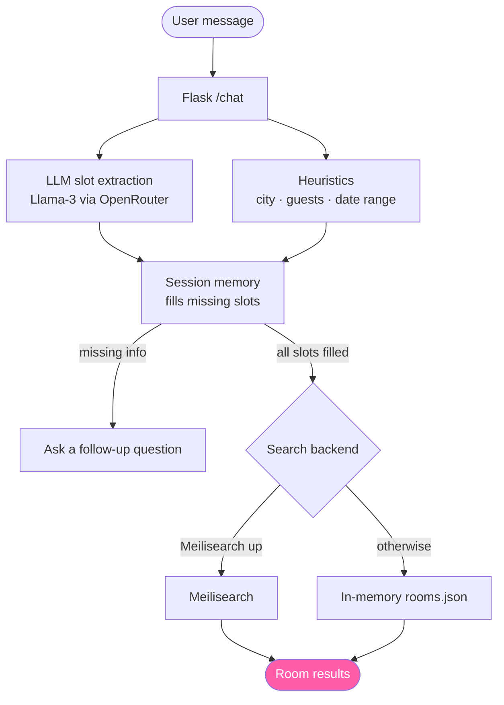

> **© 2026 Chiranjeev (@chiranr19) — All Rights Reserved.** This project is **source-available for viewing only**; it is *not* open source. No copying, reuse, modification, deployment, or redistribution of any part of it (or its underlying ideas) without prior written permission — see [LICENSE](./LICENSE) and [SIGNATURE](./SIGNATURE). Prospective employers and collaborators are welcome to read the code.  ·  authorship sigil `6YHJ·BKOP·VJCG·NOAX`

# ChippyInn Booking Bot


A conversational hotel-room booking assistant. It parses natural-language requests
("a room in Chennai for 2 guests, Aug 20 to 23, under ₹1500"), keeps per-session
memory so it doesn't re-ask what you've already answered, and returns matching rooms.

## How it works



- **LLM slot-filling** extracts location, dates, guests, and budget from free text.
- **Heuristic fallbacks** for city, guest count, and date-range parsing keep it useful
  even when the model is unsure.
- **Resilient search** — uses Meilisearch when it's running, and otherwise falls back
  to a built-in in-memory filter over `rooms.json`, so it runs from a clean clone with
  zero extra infrastructure.

## Example

```
You:  I need a room in Chennai for 2 people
Bot:  What dates will you be staying (check-in and check-out)?
You:  Aug 20 to 23, budget 1500
Bot:  • Suite #1 - ChippyInn — ₹1388 | Chennai | sleeps 2
```

## Run

```bash
python -m venv venv && source venv/bin/activate   # Windows: venv\Scripts\activate
pip install -r requirements.txt

export OPENROUTER_API_KEY=<your key>              # Windows: set OPENROUTER_API_KEY=<your key>
python server.py
```

Then open <http://localhost:5000> and start chatting. Get an OpenRouter key at
<https://openrouter.ai/keys>. The key is read from the `OPENROUTER_API_KEY` environment
variable — it is never hard-coded or committed.

### Optional: Meilisearch backend

In-memory search is enabled by default. To use Meilisearch instead, start it first:

```bash
docker run -p 7700:7700 getmeili/meilisearch
```

On startup the server prints which backend it selected.

## What's inside

| File | Purpose |
|------|---------|
| `server.py` | Flask backend: LLM extraction, session memory, room search (Meili or in-memory) |
| `rooms.json` | Sample room inventory |
| `static/` | Minimal chat front-end (`index.html`, `chat-widget.html`, `script.js`) |

## License

MIT — see [LICENSE](LICENSE).
